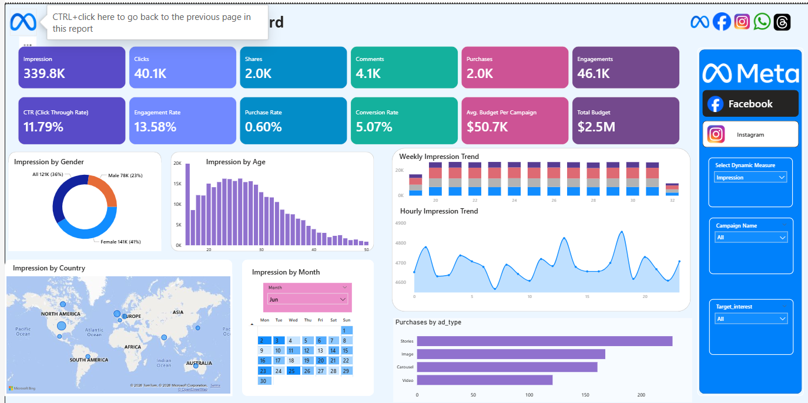

# 📊 Meta Ad Performance Dashboard (Power BI)

An interactive Power BI dashboard designed to analyze and monitor Meta advertisement performance.  
This project provides insights into campaign reach, engagement, purchases, and audience behavior to support data-driven marketing decisions.

---

## 🚀 Project Overview

This dashboard visualizes Meta ad campaign performance using dynamic KPIs and interactive filters.  
It helps marketers evaluate ad effectiveness, audience engagement, and purchase trends across different demographics and time periods.

---

## 🎯 Objectives

- Track advertisement performance metrics
- Measure engagement and purchase behavior
- Analyze audience demographics
- Identify performance trends over time
- Improve marketing strategy using data insights

---

## 🖼 Dashboard Preview

---

## 📌 Key Features

- KPI summary cards for quick insights
- Impression and engagement analysis
- Purchase tracking by ad type
- Demographic breakdown (age & gender)
- Time-based performance trends
- Interactive slicers and filters
- Campaign-level drill-down analysis

---

## 📈 Metrics Included

- Impressions
- Clicks
- Shares
- Comments
- Purchases
- Engagement Rate
- Click Through Rate (CTR)
- Conversion Rate
- Budget allocation

---

## 🛠 Tools & Technologies

- Power BI Desktop
- Power Query (data cleaning)
- DAX (calculated measures)
- Excel / CSV dataset

---

